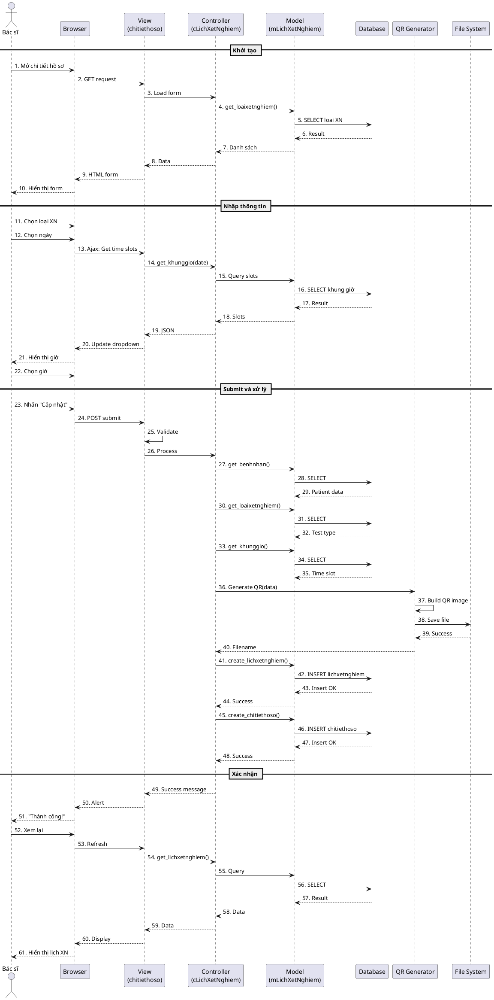

# Sơ đồ Sequence UML: Chức năng Đặt Lịch Xét Nghiệm

## 1. Tổng quan

Tài liệu này mô tả sơ đồ sequence (trình tự) cho chức năng **Đặt lịch xét nghiệm** trong hệ thống quản lý bệnh án điện tử. Chức năng này cho phép bác sĩ đặt lịch xét nghiệm cho bệnh nhân sau khi khám bệnh.

---

## 2. Các thành phần tham gia (Actors & Components)

### 2.1. Actors
- **Bác sĩ (Doctor)**: Người đặt lịch xét nghiệm cho bệnh nhân

### 2.2. System Components
- **Browser**: Trình duyệt web của bác sĩ
- **View (chitiethoso/index.php)**: Giao diện người dùng
- **Controller (cLichXetNghiem)**: Xử lý logic nghiệp vụ
- **Model (mLichXetNghiem)**: Tương tác với database
- **Database (MySQL)**: Lưu trữ dữ liệu
- **QR Code Generator**: Tạo mã QR cho lịch xét nghiệm
- **File System**: Lưu trữ file QR code

---

## 3. Sơ đồ Sequence UML (Text-based)

```
┌───────┐     ┌─────────┐     ┌──────┐     ┌────────────┐     ┌───────┐     ┌──────────┐     ┌──────────┐     ┌──────────┐
│ Bác sĩ│     │ Browser │     │ View │     │ Controller │     │ Model │     │ Database │     │QR Generator│   │File System│
└───┬───┘     └────┬────┘     └──┬───┘     └─────┬──────┘     └───┬───┘     └────┬─────┘     └─────┬─────┘     └────┬─────┘
    │              │               │               │                │              │                 │                │
    │ 1. Mở chi tiết hồ sơ bệnh án│               │                │              │                 │                │
    │──────────────>│               │               │                │              │                 │                │
    │              │ 2. GET request│               │                │              │                 │                │
    │              │──────────────>│               │                │              │                 │                │
    │              │               │ 3. Load form  │                │              │                 │                │
    │              │               │───────────────>│                │              │                 │                │
    │              │               │               │ 4. get_loaixetnghiem()        │                 │                │
    │              │               │               │────────────────>│              │                 │                │
    │              │               │               │                │ 5. SELECT    │                 │                │
    │              │               │               │                │─────────────>│                 │                │
    │              │               │               │                │<─────────────│                 │                │
    │              │               │               │                │ 6. Result    │                 │                │
    │              │               │               │<────────────────│              │                 │                │
    │              │               │<───────────────│ 7. Loại XN     │              │                 │                │
    │              │<──────────────│ 8. HTML form  │                │              │                 │                │
    │<──────────────│               │               │                │              │                 │                │
    │              │               │               │                │              │                 │                │
    │ 9. Chọn tab "Xét nghiệm"     │               │                │              │                 │                │
    │──────────────>│               │               │                │              │                 │                │
    │              │               │               │                │              │                 │                │
    │ 10. Chọn loại xét nghiệm     │               │                │              │                 │                │
    │──────────────>│               │               │                │              │                 │                │
    │              │               │               │                │              │                 │                │
    │ 11. Chọn ngày xét nghiệm     │               │                │              │                 │                │
    │──────────────>│               │               │                │              │                 │                │
    │              │ 12. Ajax: Load time slots     │                │              │                 │                │
    │              │──────────────>│               │                │              │                 │                │
    │              │               │ 13. get_khunggio(date)         │              │                 │                │
    │              │               │───────────────>│────────────────>│             │                 │                │
    │              │               │               │                │ 14. SELECT   │                 │                │
    │              │               │               │                │─────────────>│                 │                │
    │              │               │               │                │<─────────────│                 │                │
    │              │               │               │<────────────────│ 15. Slots    │                 │                │
    │              │               │<───────────────│               │              │                 │                │
    │              │<──────────────│ 16. JSON slots│               │              │                 │                │
    │<──────────────│               │               │                │              │                 │                │
    │              │               │               │                │              │                 │                │
    │ 17. Chọn giờ xét nghiệm      │               │                │              │                 │                │
    │──────────────>│               │               │                │              │                 │                │
    │              │               │               │                │              │                 │                │
    │ 18. Nhấn "Cập nhật hồ sơ"    │               │                │              │                 │                │
    │──────────────>│               │               │                │              │                 │                │
    │              │ 19. POST submit               │                │              │                 │                │
    │              │──────────────>│               │                │              │                 │                │
    │              │               │ 20. Validate input            │              │                 │                │
    │              │               │───────────────>│               │              │                 │                │
    │              │               │               │ 21. get_benhnhan(mahoso)      │                 │                │
    │              │               │               │────────────────>│──────────────>                │                │
    │              │               │               │<────────────────│<──────────────                │                │
    │              │               │               │                │              │                 │                │
    │              │               │               │ 22. get_loaixetnghiem(id)     │                 │                │
    │              │               │               │────────────────>│──────────────>                │                │
    │              │               │               │<────────────────│<──────────────                │                │
    │              │               │               │                │              │                 │                │
    │              │               │               │ 23. get_khunggio(id)          │                 │                │
    │              │               │               │────────────────>│──────────────>                │                │
    │              │               │               │<────────────────│<──────────────                │                │
    │              │               │               │                │              │                 │                │
    │              │               │               │ 24. Build QR data             │                 │                │
    │              │               │               │──────────────────────────────────────────────────>              │
    │              │               │               │                │              │ 25. Generate QR │                │
    │              │               │               │                │              │<─────────────────               │
    │              │               │               │                │              │                 │ 26. Save file  │
    │              │               │               │                │              │                 │───────────────>│
    │              │               │               │<──────────────────────────────────────────────────────────────────│
    │              │               │               │                │              │                 │ 27. Success    │
    │              │               │               │ 28. create_lichxetnghiem()    │                 │                │
    │              │               │               │────────────────>│              │                 │                │
    │              │               │               │                │ 29. INSERT   │                 │                │
    │              │               │               │                │─────────────>│                 │                │
    │              │               │               │                │              │ 30. Insert OK   │                │
    │              │               │               │                │<─────────────│                 │                │
    │              │               │               │<────────────────│ 31. Success  │                 │                │
    │              │               │               │                │              │                 │                │
    │              │               │               │ 32. create_chitiethoso()      │                 │                │
    │              │               │               │────────────────>│──────────────>                │                │
    │              │               │               │<────────────────│<──────────────                │                │
    │              │               │<───────────────│               │              │                 │                │
    │              │               │ 33. Success msg               │              │                 │                │
    │              │<──────────────│               │                │              │                 │                │
    │<──────────────│ 34. Alert success            │                │              │                 │                │
    │              │               │               │                │              │                 │                │
    │ 35. Xem lại thông tin lịch XN                │                │              │                 │                │
    │──────────────>│               │               │                │              │                 │                │
    │              │ 36. GET refresh               │                │              │                 │                │
    │              │──────────────>│               │                │              │                 │                │
    │              │               │ 37. get_lichxetnghiem(mahoso) │              │                 │                │
    │              │               │───────────────>│────────────────>│             │                 │                │
    │              │               │               │                │─────────────>│                 │                │
    │              │               │               │                │<─────────────│                 │                │
    │              │               │               │<────────────────│              │                 │                │
    │              │               │<───────────────│               │              │                 │                │
    │              │<──────────────│ 38. Display info              │              │                 │                │
    │<──────────────│               │               │                │              │                 │                │
    │              │               │               │                │              │                 │                │
```

---

## 4. Mô tả chi tiết các bước

### Giai đoạn 1: Khởi tạo và hiển thị form (Bước 1-8)

**Bước 1-3**: Bác sĩ mở trang chi tiết hồ sơ bệnh án
- Actor: Bác sĩ truy cập URL `Views/bacsi/pages/chitiethoso/index.php?mahoso={mahoso}`
- Browser gửi GET request đến View
- View xử lý request và load form

**Bước 4-6**: Load danh sách loại xét nghiệm
- Controller gọi `cLoaiXetNghiem::get_loaixetnghiem()`
- Model truy vấn database: `SELECT * FROM loaixetnghiem`
- Database trả về danh sách các loại xét nghiệm

**Bước 7-8**: Hiển thị form
- View render HTML form với dropdown loại xét nghiệm
- Browser hiển thị form cho bác sĩ

---

### Giai đoạn 2: Nhập thông tin đặt lịch (Bước 9-17)

**Bước 9**: Bác sĩ chọn tab "Xét nghiệm"
- Actor click vào tab `update-test` trong form

**Bước 10**: Chọn loại xét nghiệm
- Actor chọn loại xét nghiệm từ dropdown (ví dụ: "Xét nghiệm máu", "X-quang")

**Bước 11-16**: Chọn ngày và load khung giờ
- Actor chọn ngày xét nghiệm từ date picker (tối thiểu ngày mai)
- Browser gửi Ajax request để load các khung giờ khả dụng
- View gọi `cKhungGioXetNghiem::get_khunggio_by_date($date)`
- Model query: `SELECT * FROM khunggioxetnghiem WHERE ...`
- Database trả về danh sách khung giờ
- View trả về JSON: `[{makhunggioxetnghiem, giobatdau, gioketthuc}, ...]`
- Browser cập nhật dropdown giờ xét nghiệm

**Bước 17**: Chọn giờ xét nghiệm
- Actor chọn khung giờ từ dropdown (ví dụ: "08:00 - 09:00")

---

### Giai đoạn 3: Submit và xử lý (Bước 18-32)

**Bước 18-20**: Submit form
- Actor nhấn nút "Cập nhật hồ sơ"
- Browser gửi POST request với dữ liệu:
  ```php
  $_POST = [
      'test' => maloaixetnghiem,
      'appointmentDate' => 'YYYY-MM-DD',
      'appointmentTime' => makhunggioxetnghiem,
      'mahoso' => mahoso
  ]
  ```
- View validate dữ liệu input

**Bước 21-23**: Lấy thông tin cần thiết
- Controller lấy thông tin bệnh nhân: `get_benhnhan($mahoso)`
- Controller lấy thông tin loại xét nghiệm: `get_loaixetnghiem($maloaixetnghiem)`
- Controller lấy thông tin khung giờ: `get_khunggio($makhunggioxetnghiem)`

**Bước 24-27**: Tạo QR Code
- Controller build dữ liệu QR:
  ```
  Họ tên: [Tên bệnh nhân]
  SĐT: [Số điện thoại]
  Tên xét nghiệm: [Loại xét nghiệm]
  Ngày xét nghiệm: [Ngày]
  Giờ xét nghiệm: [Giờ bắt đầu]
  Bác sĩ đặt lịch: [Tên bác sĩ]
  ```
- Gọi QR Code Generator (Endroid QR Code Library)
- Generator tạo file PNG: `qr_[timestamp].png`
- Lưu file vào `Assets/img/qr_[timestamp].png`

**Bước 28-31**: Lưu lịch xét nghiệm vào database
- Controller gọi `cLichXetNghiem::create_lichxetnghiem()`
- Model thực hiện INSERT:
  ```sql
  INSERT INTO lichxetnghiem(mabenhnhan, maloaixetnghiem, ngayhen, 
                            makhunggio, matrangthai, mahoso, qr) 
  VALUES ('$mabenhnhan', '$maloaixetnghiem', '$ngayhen', 
          '$makhunggio', '10', '$mahoso', '$img')
  ```
- Database insert thành công, trả về true
- Controller nhận kết quả thành công

**Bước 32**: Tạo chi tiết hồ sơ
- Controller gọi `cChiTietHoSo::create_chitiethoso()` để liên kết với hồ sơ bệnh án
- Model thực hiện INSERT vào bảng `chitiethoso`

---

### Giai đoạn 4: Xác nhận và hiển thị (Bước 33-38)

**Bước 33-34**: Hiển thị thông báo thành công
- View hiển thị message: "Thành công! Cập nhật hồ sơ thành công"
- Browser hiển thị alert cho bác sĩ

**Bước 35-38**: Làm mới và hiển thị thông tin
- Trang được reload hoặc refresh
- View load lại danh sách lịch xét nghiệm: `get_lichxetnghiem($mahoso)`
- Model query database để lấy danh sách lịch xét nghiệm của hồ sơ
- Browser hiển thị lịch xét nghiệm mới đã được đặt

---

## 5. Sơ đồ Sequence UML (PlantUML Format)

Để render bằng các tool hỗ trợ PlantUML:



---

## 6. Cấu trúc Database liên quan

### 6.1. Bảng `lichxetnghiem`
```sql
CREATE TABLE `lichxetnghiem` (
  `malichxetnghiem` int(11) NOT NULL AUTO_INCREMENT,
  `mabenhnhan` varchar(100) NOT NULL,
  `maloaixetnghiem` int(11) NOT NULL,
  `ngayhen` date NOT NULL,
  `makhunggio` int(11) NOT NULL,
  `matrangthai` int(11) NOT NULL,
  `mahoso` int(11) NOT NULL,
  `qr` varchar(255) NOT NULL,
  PRIMARY KEY (`malichxetnghiem`),
  FOREIGN KEY (`mabenhnhan`) REFERENCES `benhnhan`(`mabenhnhan`),
  FOREIGN KEY (`maloaixetnghiem`) REFERENCES `loaixetnghiem`(`maloaixetnghiem`),
  FOREIGN KEY (`makhunggio`) REFERENCES `khunggioxetnghiem`(`makhunggioxetnghiem`),
  FOREIGN KEY (`matrangthai`) REFERENCES `trangthai`(`matrangthai`),
  FOREIGN KEY (`mahoso`) REFERENCES `hosobenhan`(`mahoso`)
) ENGINE=InnoDB;
```

### 6.2. Bảng `loaixetnghiem`
```sql
CREATE TABLE `loaixetnghiem` (
  `maloaixetnghiem` int(11) NOT NULL AUTO_INCREMENT,
  `tenloaixetnghiem` varchar(200) NOT NULL,
  `machuyenkhoa` int(11) NOT NULL,
  PRIMARY KEY (`maloaixetnghiem`),
  FOREIGN KEY (`machuyenkhoa`) REFERENCES `chuyenkhoa`(`machuyenkhoa`)
) ENGINE=InnoDB;
```

### 6.3. Bảng `khunggioxetnghiem`
```sql
CREATE TABLE `khunggioxetnghiem` (
  `makhunggioxetnghiem` int(11) NOT NULL AUTO_INCREMENT,
  `giobatdau` time NOT NULL,
  `gioketthuc` time NOT NULL,
  PRIMARY KEY (`makhunggioxetnghiem`)
) ENGINE=InnoDB;
```

### 6.4. Bảng `trangthai`
```sql
CREATE TABLE `trangthai` (
  `matrangthai` int(11) NOT NULL,
  `tentrangthai` varchar(50) NOT NULL,
  PRIMARY KEY (`matrangthai`)
) ENGINE=InnoDB;

-- Trạng thái lịch xét nghiệm:
-- 10: 'Đã đặt lịch'
-- 11: 'Đã hoàn thành'
-- 12: 'Đã hủy'
```

---

## 7. Quy tắc nghiệp vụ

### BR-1: Ngày xét nghiệm
- Ngày xét nghiệm phải >= ngày mai (không cho đặt lịch trong ngày)
- Validation: `min="<?php echo date('Y-m-d', strtotime('+1 day')); ?>"`

### BR-2: Khung giờ
- Chỉ hiển thị khung giờ còn trống
- Khung giờ được lấy từ bảng `khunggioxetnghiem`

### BR-3: Trạng thái mặc định
- Lịch xét nghiệm mới luôn có `matrangthai = 10` ("Đã đặt lịch")

### BR-4: QR Code
- Mỗi lịch xét nghiệm có một QR code duy nhất
- QR code chứa thông tin: bệnh nhân, loại xét nghiệm, ngày, giờ, bác sĩ
- File QR lưu tại `Assets/img/qr_[timestamp].png`

### BR-5: Liên kết hồ sơ
- Lịch xét nghiệm phải được liên kết với hồ sơ bệnh án qua bảng `chitiethoso`
- Một hồ sơ có thể có nhiều lịch xét nghiệm

### BR-6: Quyền tạo lịch
- Chỉ bác sĩ được đặt lịch xét nghiệm cho bệnh nhân
- Bác sĩ chỉ đặt lịch cho bệnh nhân đang khám

---

## 8. Luồng ngoại lệ (Exception Flows)

### E-1: Không có khung giờ trống
**Khi**: Bệnh nhân chọn ngày nhưng không có khung giờ nào khả dụng

**Xử lý**:
1. Ajax request trả về danh sách rỗng
2. Dropdown giờ hiển thị: "Không có khung giờ khả dụng"
3. Disable nút submit
4. Thông báo: "Vui lòng chọn ngày khác"

### E-2: Lỗi tạo QR Code
**Khi**: Không thể tạo hoặc lưu file QR code

**Xử lý**:
1. Kiểm tra quyền ghi file vào `Assets/img/`
2. Log lỗi
3. Hiển thị: "Lỗi tạo mã QR, vui lòng thử lại"
4. Rollback: Không tạo lịch xét nghiệm

### E-3: Lỗi database
**Khi**: INSERT vào `lichxetnghiem` thất bại

**Xử lý**:
1. Model trả về false
2. Controller nhận lỗi
3. Xóa file QR đã tạo (nếu có)
4. Hiển thị: "Lỗi đặt lịch, vui lòng thử lại"

### E-4: Dữ liệu không hợp lệ
**Khi**: Thiếu thông tin bắt buộc hoặc dữ liệu không đúng format

**Xử lý**:
1. View validate input trước khi submit
2. Nếu không hợp lệ, highlight field lỗi
3. Hiển thị message cụ thể: "Vui lòng chọn [field name]"
4. Không gửi request đến server

---

## 9. Ví dụ dữ liệu

### 9.1. POST Request
```php
$_POST = [
    'test' => '5',                    // maloaixetnghiem
    'appointmentDate' => '2024-12-10',
    'appointmentTime' => '3',          // makhunggioxetnghiem
    'mahoso' => '1',
    'btnupdate' => 'submit'
]
```

### 9.2. QR Code Content
```
Họ tên: Nguyễn Văn A
SĐT: 0123456789
Tên xét nghiệm: Xét nghiệm máu tổng quát
Ngày xét nghiệm: 2024-12-10
Giờ xét nghiệm: 08:00
Bác sĩ đặt lịch: BS. Trần Thị B
```

### 9.3. Database Insert
```sql
INSERT INTO lichxetnghiem(mabenhnhan, maloaixetnghiem, ngayhen, 
                          makhunggio, matrangthai, mahoso, qr) 
VALUES ('BN_11703977', '5', '2024-12-10', 
        '3', '10', '1', 'qr_1733356800.png');
```

---

## 10. Các file code liên quan

### 10.1. Controllers
- **clichxetnghiem.php**
  - `create_lichxetnghiem($mabenhnhan, $maloaixetnghiem, $ngayhen, $makhunggio, $trangthailichxetnghiem, $mahoso, $img)`
  - `get_lichxetnghiem_mahoso($mahoso)`

### 10.2. Models
- **mlichxetnghiem.php**
  - `insert_lichxetnghiem(...)`: INSERT vào database
  - `select_lichxetnghiem_mahoso($mahoso)`: SELECT lịch xét nghiệm

### 10.3. Views
- **Views/bacsi/pages/chitiethoso/index.php**
  - Form đặt lịch xét nghiệm (line 670-700)
  - Ajax load khung giờ
  - Xử lý submit (line 100-140)

### 10.4. Libraries
- **Endroid QR Code** (`vendor/endroid/qr-code`)
  - `Builder::build()`: Tạo QR code

---

## 11. So sánh với chức năng tạo đơn thuốc

| Tiêu chí | Đặt lịch xét nghiệm | Tạo đơn thuốc |
|----------|---------------------|---------------|
| **Số bước** | ~60 bước | ~40 bước |
| **Components** | 8 components | 5 components |
| **Tính năng đặc biệt** | QR Code generation | Nhiều thuốc trong 1 đơn |
| **Ajax calls** | 1 (load khung giờ) | 0 |
| **File operations** | Lưu QR code PNG | Không |
| **Database tables** | 5 tables | 3 tables |
| **Validation phức tạp** | Ngày, giờ, khung giờ trống | Liều dùng, số ngày |

---

## 12. Tổng kết

Sơ đồ sequence này mô tả đầy đủ quy trình đặt lịch xét nghiệm từ khi bác sĩ mở form cho đến khi hoàn tất và hiển thị thông tin. Các điểm nổi bật:

✅ **Tương tác người dùng**: 7 bước tương tác với bác sĩ
✅ **Ajax call**: Load dynamic khung giờ dựa trên ngày chọn
✅ **QR Code**: Tự động tạo mã QR cho mỗi lịch hẹn
✅ **Database**: Tương tác với 5 bảng liên quan
✅ **Error handling**: 4 luồng ngoại lệ được xử lý
✅ **Business rules**: 6 quy tắc nghiệp vụ được áp dụng

---

**Ghi chú**: Sơ đồ này có thể được render bằng các công cụ hỗ trợ PlantUML như:
- [PlantUML Online Editor](http://www.plantuml.com/plantuml/uml/)
- VS Code Extension: PlantUML
- IntelliJ IDEA Plugin: PlantUML integration

**Người tạo**: GitHub Copilot
**Ngày tạo**: 2024-12-04
**Phiên bản**: 1.0
