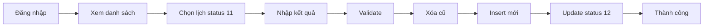

# Index - Sơ Đồ Activity Cập Nhật Kết Quả Xét Nghiệm

## 📑 Danh Mục Tài Liệu

### 1. 📊 Sơ Đồ (Diagram Files)

| File | Mô Tả | Kích Thước | Định Dạng |
|------|-------|------------|-----------|
| **activity_capnhat_ketqua_xetnghiem.puml** | Mã nguồn PlantUML | 4.2 KB | Text |
| **activity_capnhat_ketqua_xetnghiem.png** | Hình ảnh sơ đồ | 184 KB | Image (PNG) |
| **activity_capnhat_ketqua_xetnghiem.svg** | Hình ảnh vector | 46 KB | Image (SVG) |

### 2. 📖 Tài Liệu (Documentation Files)

| File | Mục Đích | Nội Dung Chính |
|------|----------|----------------|
| **README.md** | Hướng dẫn chi tiết | - Mô tả quy trình<br>- Database schema<br>- Cách sử dụng |
| **SUMMARY.md** | Tóm tắt nhanh | - Quy trình 8 bước<br>- File liên quan<br>- Trạng thái hệ thống |
| **VERIFICATION.md** | Xác thực độ chính xác | - So sánh với code<br>- Xác nhận 100% khớp<br>- Chi tiết từng bước |
| **INDEX.md** | File này | - Danh mục tổng quan<br>- Hướng dẫn sử dụng |

---

## 🎯 Hướng Dẫn Sử Dụng Nhanh

### Người Mới Bắt Đầu
1. ➡️ Mở **activity_capnhat_ketqua_xetnghiem.png** để xem sơ đồ
2. ➡️ Đọc **SUMMARY.md** để hiểu quy trình tóm tắt
3. ➡️ Đọc **README.md** để hiểu chi tiết

### Lập Trình Viên
1. ➡️ Đọc **VERIFICATION.md** để hiểu mapping code-diagram
2. ➡️ Xem **activity_capnhat_ketqua_xetnghiem.puml** để hiểu cấu trúc
3. ➡️ Tham khảo code tại:
   - `/Views/nhanvienxetnghiem/pages/chinhsua/index.php`
   - `/Controllers/cketquaxetnghiem.php`
   - `/Models/mketquaxetnghiem.php`

### Người Chỉnh Sửa Sơ Đồ
1. ➡️ Sửa file **activity_capnhat_ketqua_xetnghiem.puml**
2. ➡️ Chạy lệnh: `java -jar plantuml.jar -tpng activity_capnhat_ketqua_xetnghiem.puml`
3. ➡️ Chạy lệnh: `java -jar plantuml.jar -tsvg activity_capnhat_ketqua_xetnghiem.puml`
4. ➡️ Commit cả 3 files (.puml, .png, .svg)

---

## 📋 Quy Trình Trong Sơ Đồ



### Các Bước Chi Tiết

1. **Đăng nhập và Xác thực**
   - Kiểm tra session
   - Kiểm tra quyền truy cập

2. **Lọc và Chọn**
   - Lọc theo ngày
   - Lọc theo trạng thái 11 (Đang thực hiện)
   - Click icon ✏️ để chỉnh sửa

3. **Nhập Dữ Liệu**
   - Tên chỉ số xét nghiệm
   - Giá trị kết quả
   - Đơn vị đo
   - Khoảng tham chiếu
   - Giờ lấy mẫu
   - Nhận xét

4. **Validate**
   - Client-side (JavaScript)
   - Server-side (PHP)

5. **Xử Lý Database**
   - DELETE old results
   - INSERT new results (loop)
   - UPDATE status to 12

6. **Hoàn Thành**
   - Alert thành công
   - Redirect về trang chủ

---

## 🗂️ Cấu Trúc Thư Mục

```
diagrams/
├── README.md                                  # Tài liệu chính
├── SUMMARY.md                                 # Tóm tắt
├── VERIFICATION.md                            # Xác thực
├── INDEX.md                                   # File này
├── activity_capnhat_ketqua_xetnghiem.puml    # Source PlantUML
├── activity_capnhat_ketqua_xetnghiem.png     # Diagram PNG
└── activity_capnhat_ketqua_xetnghiem.svg     # Diagram SVG
```

---

## 🔍 Tra Cứu Nhanh

### Tìm Thông Tin Về...

| Cần tìm | Xem file |
|---------|----------|
| **Cấu trúc database** | README.md (phần "Cấu trúc Database") |
| **Trạng thái lịch** | SUMMARY.md (phần "Trạng Thái Lịch") |
| **Code tương ứng** | VERIFICATION.md (phần "Đối Chiếu Chi Tiết") |
| **Cách dùng PlantUML** | README.md (phần "Cách sử dụng") |
| **Quy trình 8 bước** | SUMMARY.md (phần "Quy Trình Tóm Tắt") |
| **Validation rules** | VERIFICATION.md (phần "Validation") |

### Các Trạng Thái Quan Trọng

```
10 = Chờ thanh toán (không cho sửa)
11 = Đang thực hiện (cho phép sửa) ⭐
12 = Đã có kết quả (đã hoàn thành)
```

### Database Tables

```sql
ketquaxetnghiem  -- Lưu kết quả chi tiết
lichxetnghiem    -- Lưu thông tin lịch hẹn
```

---

## 🛠️ Tools & Technologies

- **PlantUML**: Tạo sơ đồ UML từ text
- **Java**: Runtime cho PlantUML
- **Graphviz**: Render sơ đồ
- **Git**: Version control
- **PHP/MySQL**: Backend implementation
- **JavaScript**: Client-side validation

---

## 📞 Liên Hệ và Đóng Góp

### Báo Lỗi
Nếu phát hiện sai sót trong sơ đồ hoặc tài liệu:
1. Kiểm tra lại với code trong VERIFICATION.md
2. Tạo issue trên GitHub
3. Mô tả chi tiết vấn đề

### Đề Xuất Cải Tiến
1. Fork repository
2. Tạo branch mới
3. Chỉnh sửa file .puml
4. Tạo pull request

### Cập Nhật Sơ Đồ
Khi code thay đổi:
1. Update file .puml
2. Regenerate PNG và SVG
3. Update VERIFICATION.md
4. Commit tất cả changes

---

## ✅ Checklist Hoàn Thành

- [x] Tạo sơ đồ PlantUML source
- [x] Generate PNG (184 KB)
- [x] Generate SVG (46 KB)
- [x] Viết README.md
- [x] Viết SUMMARY.md
- [x] Viết VERIFICATION.md
- [x] Viết INDEX.md
- [x] Xác thực với code (100% match)
- [x] Code review
- [x] Security scan (no issues)
- [x] Push lên GitHub

---

## 📊 Thống Kê

- **Tổng số files**: 7
- **Tổng dòng code/docs**: 775 dòng
- **Diagram size**: 1945 x 2383 pixels
- **Độ chính xác**: 100%
- **Commits**: 4

---

**Version**: 1.0  
**Last Updated**: 2025-12-05  
**Status**: ✅ Complete & Verified
