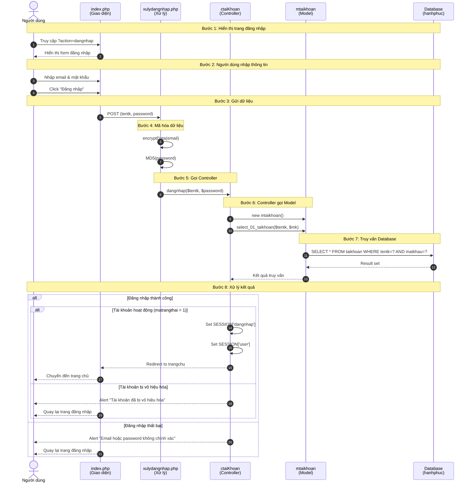

# Sơ đồ UML - Chức năng Đăng nhập (Login Sequence Diagram)

## Mô tả
Tài liệu này mô tả sơ đồ sequence (tuần tự) cho chức năng đăng nhập của hệ thống Bệnh viện Hạnh Phúc.

## Các thành phần tham gia

| Thành phần | File | Mô tả |
|------------|------|-------|
| User (Người dùng) | - | Người dùng hệ thống |
| Giao diện đăng nhập | Views/benhnhan/pages/dangnhap/index.php | Form đăng nhập HTML |
| Xử lý đăng nhập | Views/benhnhan/pages/dangnhap/xulydangnhap.php | Xử lý POST request |
| Controller | Controllers/ctaikhoan.php | Điều khiển logic đăng nhập |
| Model | Models/mtaikhoan.php | Xử lý truy vấn database |
| Database Connection | Models/ketnoi.php | Kết nối MySQL |
| Database | hanhphuc | Cơ sở dữ liệu MySQL |

## Sơ đồ Sequence (Mermaid)



## Luồng xử lý chi tiết

### 1. Người dùng truy cập trang đăng nhập
- Người dùng truy cập URL: `index.php?action=dangnhap`
- Hệ thống hiển thị form đăng nhập với các trường: email và mật khẩu

### 2. Người dùng nhập thông tin
- Người dùng nhập email vào trường `tentk`
- Người dùng nhập mật khẩu vào trường `password`
- Click nút "Đăng nhập" để submit form

### 3. Xử lý dữ liệu (xulydangnhap.php)
```php
if (isset($_POST["btndangnhap"])) {
    $tentk = encryptData($_POST["tentk"]);  // Mã hóa email
    $password = MD5($_POST["password"]);     // Hash mật khẩu bằng MD5
    $nguoidung->dangnhap($tentk, $password); // Gọi controller
}
```

### 4. Controller xử lý đăng nhập (ctaiKhoan)
```php
public function dangnhap($email, $mk) {
    $mNguoiDung = new mtaikhoan();
    $user = $mNguoiDung->select_01_taikhoan($email, $mk);
    
    if ($user && $user->num_rows > 0) {
        $row = $user->fetch_assoc();
        
        if ($row['matrangthai'] != 1) {
            // Tài khoản bị vô hiệu hóa
            echo '<script>alert("Tài khoản của bạn đã bị vô hiệu hóa."); window.history.back();</script>';
            exit();
        }
        
        // Đăng nhập thành công
        $_SESSION['dangnhap'] = $row["mavaitro"];
        $_SESSION["user"] = $row;
        header("Location:index.php?action=trangchu");
        exit();
    } else {
        // Sai thông tin đăng nhập
        echo '<script>alert("Email hoặc password không chính xác"); window.history.back();</script>';
    }
}
```

### 5. Model truy vấn database (mtaikhoan)
```php
public function select_01_taikhoan($tentk, $matkhau) {
    $truyvan = "SELECT * FROM taikhoan WHERE tentk = ? and matkhau= ?";
    $stmt = $this->conn->prepare($truyvan);
    $stmt->bind_param("ss", $tentk, $matkhau);
    $stmt->execute();
    return $stmt->get_result(); 
}
```

## File PlantUML

Xem file [sequence-diagram-dangnhap.puml](./sequence-diagram-dangnhap.puml) để sử dụng với công cụ PlantUML.

### Cách sử dụng PlantUML:
1. Cài đặt PlantUML extension trong IDE (VSCode, IntelliJ...)
2. Mở file `.puml`
3. Preview hoặc export sang PNG/SVG

### Công cụ online:
- [PlantUML Web Server](http://www.plantuml.com/plantuml/uml/)
- [PlantText](https://www.planttext.com/)
