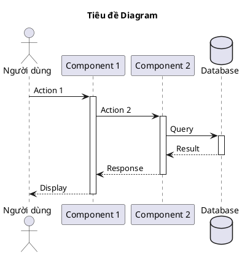

# Tài liệu Hệ thống Quản lý Bệnh viện Hạnh Phúc

## Giới thiệu
Đây là thư mục chứa tài liệu kỹ thuật cho hệ thống quản lý bệnh viện Hạnh Phúc, bao gồm các sơ đồ UML, tài liệu thiết kế và hướng dẫn sử dụng.

## Cấu trúc thư mục

```
docs/
├── README.md                    # File này
└── diagrams/                    # Thư mục chứa các sơ đồ UML
    ├── README.md                # Tài liệu chi tiết về sơ đồ
    ├── taohoso-sequence-diagram.puml  # Source PlantUML
    ├── taohoso-sequence-diagram.png   # Hình ảnh PNG
    └── taohoso-sequence-diagram.svg   # Hình ảnh SVG
```

## Danh sách sơ đồ

### 1. Sequence Diagram - Tạo Hồ Sơ Khám Bệnh
- **File**: [diagrams/taohoso-sequence-diagram.puml](diagrams/taohoso-sequence-diagram.puml)
- **Mô tả**: Sơ đồ tuần tự mô tả quy trình đầy đủ của chức năng tạo hồ sơ bệnh nhân để đăng ký khám bệnh
- **Các thành phần**:
  - Người dùng (Người thân)
  - Browser
  - View Layer (index.php)
  - Controller Layer (cBenhNhan)
  - Model Layer (mBenhNhan)
  - Database (MySQL)
- **Xem chi tiết**: [diagrams/README.md](diagrams/README.md)

## Công nghệ sử dụng

### Backend
- **PHP**: Ngôn ngữ lập trình chính
- **MySQL**: Cơ sở dữ liệu
- **Architecture**: MVC (Model-View-Controller)

### Frontend
- **HTML/CSS**: Giao diện người dùng
- **JavaScript**: Validation và xử lý tương tác
- **SweetAlert2**: Hiển thị thông báo đẹp

### Công cụ tài liệu
- **PlantUML**: Tạo sơ đồ UML
- **Markdown**: Viết tài liệu

## Cách sử dụng PlantUML

### Online
Truy cập: http://www.plantuml.com/plantuml/uml/
- Copy nội dung file `.puml` và paste vào
- Diagram sẽ được tự động render

### Local với Java
```bash
# Download PlantUML
wget https://github.com/plantuml/plantuml/releases/latest/download/plantuml.jar

# Tạo diagram PNG
java -jar plantuml.jar diagram.puml

# Tạo diagram SVG (vector, chất lượng tốt hơn)
java -jar plantuml.jar -tsvg diagram.puml
```

### VS Code Extension
1. Cài extension "PlantUML"
2. Mở file `.puml`
3. Alt+D để preview

## Hướng dẫn đóng góp

### Thêm sơ đồ mới
1. Tạo file `.puml` trong thư mục `diagrams/`
2. Đặt tên file theo quy tắc: `<tên-chức-năng>-<loại-diagram>.puml`
3. Generate PNG và SVG:
   ```bash
   java -jar plantuml.jar diagram.puml
   java -jar plantuml.jar -tsvg diagram.puml
   ```
4. Cập nhật README.md với mô tả sơ đồ mới
5. Commit và push

### Quy tắc đặt tên
- Sử dụng tiếng Việt không dấu, ngăn cách bằng dấu gạch ngang
- Ví dụ: `datlichkham-sequence-diagram.puml`
- Loại diagram: `sequence`, `class`, `usecase`, `activity`, `state`, `component`, etc.

### Template PlantUML cơ bản



## Tài liệu tham khảo

### PlantUML
- Website: https://plantuml.com/
- Sequence Diagram: https://plantuml.com/sequence-diagram
- Class Diagram: https://plantuml.com/class-diagram
- Use Case Diagram: https://plantuml.com/use-case-diagram

### UML
- OMG UML Specification: https://www.omg.org/spec/UML/
- UML Diagrams: https://www.uml-diagrams.org/

## Liên hệ

Nếu có bất kỳ câu hỏi nào về tài liệu, vui lòng liên hệ với nhóm phát triển.

---
*Cập nhật lần cuối: 2025-12-03*
