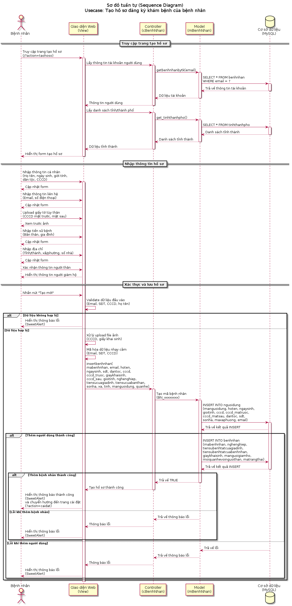

# Sơ đồ UML - Usecase Tạo Hồ Sơ Đăng Ký Khám Bệnh

## Mô tả

Tài liệu này chứa sơ đồ tuần tự (Sequence Diagram) cho usecase **"Tạo hồ sơ đăng ký khám bệnh của bệnh nhân"** trong hệ thống Bệnh viện Hạnh Phúc.

## File sơ đồ

- **taohoso-sequence-diagram.puml**: Sơ đồ tuần tự PlantUML mô tả quy trình tạo hồ sơ bệnh nhân
- **Sequence_Diagram_TaoHoSo_DangKyKhamBenh.png**: Hình ảnh PNG của sơ đồ
- **Sequence_Diagram_TaoHoSo_DangKyKhamBenh.svg**: Hình ảnh SVG của sơ đồ (chất lượng cao)

## Xem trước sơ đồ



## Quy trình chính

Sơ đồ mô tả các bước sau:

### 1. Truy cập trang tạo hồ sơ
- Bệnh nhân truy cập vào trang tạo hồ sơ (`?action=taohoso`)
- Hệ thống tải thông tin tài khoản người dùng từ database
- Hệ thống tải danh sách tỉnh/thành phố
- Hiển thị form tạo hồ sơ cho bệnh nhân

### 2. Nhập thông tin hồ sơ
- **Thông tin cá nhân**: Họ tên, ngày sinh, giới tính, dân tộc, CCCD
- **Thông tin liên hệ**: Email, số điện thoại
- **Giấy tờ tùy thân**: Upload CCCD mặt trước, mặt sau (hoặc giấy khai sinh nếu dưới 16 tuổi)
- **Tiền sử bệnh**: Tiền sử bệnh của bản thân và gia đình
- **Địa chỉ**: Tỉnh/thành phố, xã/phường, số nhà
- **Thông tin người thân**: Quan hệ với người giám hộ (bố/mẹ/con)

### 3. Xác thực và lưu hồ sơ
- Hệ thống validate dữ liệu đầu vào:
  - Email phải hợp lệ
  - Số điện thoại phải có 10-11 chữ số
  - CCCD/CMND phải có 9 hoặc 12 chữ số
  - Họ tên chỉ chứa chữ cái và khoảng trắng
- Upload và lưu file ảnh CCCD/giấy khai sinh
- Mã hóa dữ liệu nhạy cảm (Email, SĐT, CCCD)
- Tạo mã bệnh nhân tự động (BN_xxxxxxxx)
- Lưu thông tin vào database:
  - Bảng `nguoidung`: Thông tin cá nhân cơ bản
  - Bảng `benhnhan`: Thông tin bệnh nhân chi tiết
- Hiển thị thông báo kết quả và chuyển hướng

## Các thành phần tham gia

### 1. Actor (Người tham gia)
- **Bệnh nhân**: Người sử dụng đăng ký hồ sơ khám bệnh

### 2. Các lớp trong hệ thống

#### View Layer (Giao diện)
- **File**: `Views/benhnhan/pages/taohoso/index.php`
- **Chức năng**: 
  - Hiển thị form nhập liệu
  - Validate dữ liệu phía client
  - Xử lý upload file
  - Hiển thị thông báo kết quả

#### Controller Layer (Điều khiển)
- **File**: `Controllers/cbenhnhan.php`
- **Chức năng**:
  - Nhận request từ View
  - Xử lý logic nghiệp vụ
  - Gọi Model để thao tác với database
  - Trả về kết quả cho View

#### Model Layer (Mô hình dữ liệu)
- **File**: `Models/mbenhnhan.php`
- **Chức năng**:
  - Thao tác với database
  - Thực hiện các câu truy vấn SQL INSERT, SELECT
  - Trả về kết quả cho Controller

#### Database (Cơ sở dữ liệu)
- **DBMS**: MySQL
- **Bảng liên quan**:
  - `nguoidung`: Lưu thông tin cơ bản người dùng
  - `benhnhan`: Lưu thông tin bệnh nhân
  - `tinhthanhpho`: Danh sách tỉnh thành
  - `xaphuong`: Danh sách xã phường

## Cách xem sơ đồ

### Phương pháp 1: Sử dụng trình xem PlantUML online
1. Truy cập [PlantUML Online Server](http://www.plantuml.com/plantuml/uml/)
2. Copy nội dung file `taohoso-sequence-diagram.puml`
3. Paste vào editor và xem kết quả

### Phương pháp 2: Sử dụng VS Code
1. Cài đặt extension "PlantUML" trong VS Code
2. Mở file `taohoso-sequence-diagram.puml`
3. Nhấn `Alt + D` để xem preview

### Phương pháp 3: Sử dụng PlantUML command line
```bash
# Cài đặt PlantUML
sudo apt-get install plantuml

# Generate PNG image
plantuml taohoso-sequence-diagram.puml

# Generate SVG image
plantuml -tsvg taohoso-sequence-diagram.puml
```

## Lưu ý bảo mật

Hệ thống có các biện pháp bảo mật:
- Mã hóa dữ liệu nhạy cảm (Email, SĐT, CCCD) trước khi lưu vào database
- Upload file được kiểm tra extension (chỉ chấp nhận jpg, jpeg, png)
- Tên file được tạo ngẫu nhiên để tránh trùng lặp
- Validate dữ liệu đầu vào để tránh SQL Injection và XSS

## Tác giả

Khóa luận tốt nghiệp - Hệ thống quản lý bệnh viện Hạnh Phúc

## Cập nhật

- **Ngày tạo**: 2025-12-03
- **Phiên bản**: 1.0
