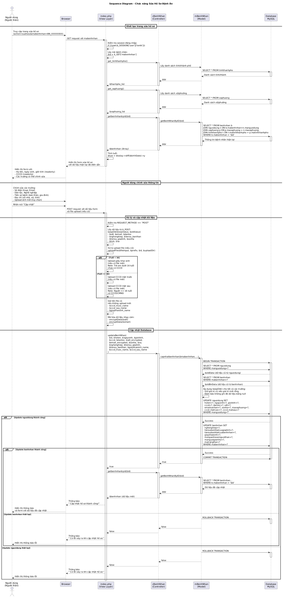

# Sequence UML Diagram - Chức năng Sửa Hồ Sơ Bệnh Án

## Mô tả
Đây là sơ đồ tuần tự (Sequence Diagram) mô tả quy trình sửa/cập nhật hồ sơ bệnh nhân trong hệ thống quản lý bệnh viện Hạnh Phúc.

## Sơ đồ



*Sơ đồ tuần tự mô tả quy trình cập nhật hồ sơ bệnh nhân*

### Files có sẵn:
- **suahoso-sequence-diagram.puml**: PlantUML source code
- **suahoso-sequence-diagram.png**: Hình ảnh PNG (376KB)
- **suahoso-sequence-diagram.svg**: Vector SVG (61KB, có thể scale lên mà không mất chất lượng)

## Các thành phần tham gia

### 1. Người dùng (Actor)
- **Vai trò**: Người thân (người giám hộ) của bệnh nhân
- **Mục đích**: Cập nhật thông tin hồ sơ bệnh nhân đã tồn tại

### 2. Browser
- Giao diện người dùng
- Hiển thị form với dữ liệu hiện tại
- Hiển thị thông báo kết quả

### 3. View Layer (Views/benhnhan/pages/suahoso/index.php)
- Hiển thị form sửa hồ sơ với dữ liệu hiện tại
- Xử lý request POST
- Xử lý upload file (nếu có)
- Mã hóa thông tin nhạy cảm

### 4. Controller Layer (Controllers/cbenhnhan.php)
- Class: `cBenhNhan`
- Method chính: `updateBenhNhan()`
- Xử lý logic nghiệp vụ
- Gọi các phương thức từ Model

### 5. Model Layer (Models/mbenhnhan.php)
- Class: `mBenhNhan`
- Method chính: `capnhatbenhnhan()`
- Tương tác với Database
- Sử dụng Transaction để đảm bảo tính toàn vẹn
- Áp dụng keepOld() để giữ dữ liệu cũ

### 6. Database (MySQL)
- Cập nhật thông tin trong 2 bảng:
  - `nguoidung`: Thông tin cơ bản
  - `benhnhan`: Thông tin bệnh nhân cụ thể

## Quy trình chính

### Bước 1: Khởi tạo trang sửa hồ sơ
1. Người dùng truy cập trang với URL: `?action=suahoso&mabenhnhan=BN_XXXXXXXX`
2. Hệ thống kiểm tra session đăng nhập
3. Lấy mã bệnh nhân từ URL (`$_GET['mabenhnhan']`)
4. Lấy danh sách tỉnh/thành phố và xã/phường từ database
5. Lấy thông tin hiện tại của bệnh nhân từ database:
   - Join 4 bảng: benhnhan, nguoidung, xaphuong, tinhthanhpho
   - Giải mã dữ liệu nhạy cảm (email, sdt, cccd)
6. Tính tuổi để xác định loại giấy tờ cần hiển thị
7. Hiển thị form với dữ liệu đã điền sẵn

### Bước 2: Các trường có thể chỉnh sửa

**Các trường READONLY (không thể sửa)**:
- Họ và tên
- Ngày sinh
- Giới tính
- Số CCCD/CMND

**Các trường có thể chỉnh sửa**:
- Số điện thoại
- Email cá nhân
- Dân tộc
- Nghề nghiệp
- Tiền sử bệnh tật của bản thân
- Tiền sử bệnh tật của gia đình
- Địa chỉ (số nhà, tên đường)
- Tỉnh/Thành phố
- Xã/Phường

**Upload file mới (tùy chọn)**:
- Nếu < 16 tuổi: Giấy khai sinh
- Nếu >= 16 tuổi: CCCD mặt trước và mặt sau

### Bước 3: Xử lý cập nhật

#### 3.1. Nhận dữ liệu từ form
- Sử dụng hàm `keepOld($newValue, $oldValue)`:
  - Nếu giá trị mới rỗng hoặc null → giữ giá trị cũ
  - Nếu giá trị mới hợp lệ → sử dụng giá trị mới

#### 3.2. Xử lý upload file
```php
function uploadFile($fileInput, $prefix, $id, $uploadDir) {
    if(isset($_FILES[$fileInput]) && $_FILES[$fileInput]['error']===0) {
        $allowed = ['jpg','jpeg','png','gif'];
        $ext = strtolower(pathinfo($_FILES[$fileInput]['name'], PATHINFO_EXTENSION));
        if(!in_array($ext, $allowed)) return null;
        $filename = $prefix . "_{$id}_" . time() . "." . $ext;
        move_uploaded_file($_FILES[$fileInput]['tmp_name'], $uploadDir . $filename);
        return $filename;
    }
    return null;
}
```

- Kiểm tra file upload có hợp lệ không
- Validate định dạng (jpg, jpeg, png, gif)
- Tạo tên file unique: `{prefix}_{id}_{timestamp}.{ext}`
- Lưu vào thư mục: `Assets/img/cccd/`
- **Quan trọng**: Nếu không upload file mới, giữ tên file cũ

#### 3.3. Mã hóa dữ liệu nhạy cảm
- Email: `encryptData($email)`
- Số điện thoại: `encryptData($sdt)`

### Bước 4: Cập nhật Database với Transaction

#### 4.1. BEGIN TRANSACTION
Bắt đầu transaction để đảm bảo tính toàn vẹn dữ liệu

#### 4.2. Lấy dữ liệu cũ
```sql
-- Từ bảng nguoidung
SELECT * FROM nguoidung WHERE manguoidung=?

-- Từ bảng benhnhan
SELECT * FROM benhnhan WHERE mabenhnhan=?
```

#### 4.3. Áp dụng keepOld() cho tất cả trường
Model sử dụng method `keepOld()` để:
- So sánh giá trị mới với giá trị cũ
- Giữ giá trị cũ nếu giá trị mới rỗng
- Đảm bảo không ghi đè dữ liệu bằng null

#### 4.4. UPDATE bảng nguoidung
```sql
UPDATE nguoidung 
SET hoten=?, ngaysinh=?, gioitinh=?, 
    cccd=?, dantoc=?, sdt=?, 
    emailcanhan=?, sonha=?, maxaphuong=?, 
    cccd_matruoc=?, cccd_matsau=?
WHERE manguoidung=?
```

#### 4.5. UPDATE bảng benhnhan
```sql
UPDATE benhnhan 
SET nghenghiep=?, 
    tiensubenhtatcuagiadinh=?, 
    tiensubenhtatcuabenhnhan=?, 
    giaykhaisinh=?, 
    moiquanhevoinguoithan=?, 
    manguoigiamho=?, 
    matrangthai=? 
WHERE mabenhnhan=?
```

#### 4.6. COMMIT hoặc ROLLBACK
- **Nếu cả 2 UPDATE thành công**: COMMIT TRANSACTION
- **Nếu có bất kỳ lỗi nào**: ROLLBACK TRANSACTION

### Bước 5: Load lại dữ liệu và thông báo

#### Trường hợp thành công:
1. Load lại dữ liệu bệnh nhân từ database (dữ liệu đã cập nhật)
2. Giải mã các trường nhạy cảm
3. Hiển thị thông báo: "✅ Cập nhật hồ sơ thành công!"
4. Form hiển thị với dữ liệu mới

#### Trường hợp thất bại:
1. Hiển thị thông báo: "❌ Có lỗi xảy ra khi cập nhật hồ sơ."
2. Form vẫn hiển thị với dữ liệu người dùng đã nhập

## So sánh với Tạo Hồ Sơ

| Tiêu chí                | Tạo Hồ Sơ (taohoso)                                      | Sửa Hồ Sơ (suahoso)                                    |
|-------------------------|----------------------------------------------------------|--------------------------------------------------------|
| **Mục đích**            | Tạo mới hồ sơ bệnh nhân                                   | Cập nhật hồ sơ đã có                                   |
| **Form fields**         | Tất cả trường đều nhập mới                                | Một số trường readonly                                 |
| **Validation nghiệp vụ**| Kiểm tra tuổi (18-60), giới hạn số lượng (4 hồ sơ)       | Không có validation đặc biệt                           |
| **Database operation**  | INSERT INTO nguoidung + benhnhan                          | UPDATE nguoidung + benhnhan                            |
| **File upload**         | Bắt buộc upload ảnh giấy tờ                               | Tùy chọn (có thể giữ ảnh cũ)                           |
| **Mã bệnh nhân**        | Tạo mới: BN_XXXXXXXX                                      | Sử dụng mã có sẵn từ URL                               |
| **keepOld() logic**     | Không áp dụng (tất cả là dữ liệu mới)                     | Áp dụng cho tất cả trường                              |
| **Redirect**            | Chuyển đến trang cài đặt                                  | Load lại trang hiện tại                                |

## Đặc điểm kỹ thuật

### 1. Transaction Safety
```php
$con->begin_transaction();
try {
    // UPDATE nguoidung
    // UPDATE benhnhan
    $con->commit();
    return true;
} catch (Exception $e) {
    $con->rollback();
    return false;
}
```

### 2. Data Preservation với keepOld()
```php
private function keepOld($newValue, $oldValue) {
    return (isset($newValue) && $newValue !== '' && $newValue !== null) 
           ? $newValue 
           : $oldValue;
}
```

Hàm này được áp dụng cho:
- Tất cả trường trong bảng `nguoidung`: hoten, ngaysinh, gioitinh, cccd, dantoc, sdt, emailcanhan, sonha, maxaphuong, cccd_matruoc, cccd_matsau
- Tất cả trường trong bảng `benhnhan`: nghenghiep, tiensubenhtatcuagiadinh, tiensubenhtatcuabenhnhan, giaykhaisinh, moiquanhevoinguoithan, manguoigiamho, matrangthai

### 3. File Upload với Timestamp
```php
$filename = $prefix . "_{$id}_" . time() . "." . $ext;
```
- Format: `truoc_BN_12345678_1701598235.jpg`
- Đảm bảo tên file unique
- Dễ dàng trace back theo thời gian

### 4. Age-based File Display
```php
<?php if($tuoi < 16): ?>
    <!-- Hiển thị upload giấy khai sinh -->
<?php else: ?>
    <!-- Hiển thị upload CCCD trước/sau -->
<?php endif; ?>
```

## Mã hóa dữ liệu

Các trường nhạy cảm được mã hóa trước khi lưu và giải mã khi hiển thị:
- **Email**: `encryptData($email)` / `decryptData($benhnhan['email'])`
- **Số điện thoại**: `encryptData($sdt)` / `decryptData($benhnhan['sdt'])`
- **CCCD**: Đã được mã hóa từ lúc tạo / `decryptData($benhnhan['cccd'])`

Hàm mã hóa được định nghĩa trong `Assets/config.php`

## File liên quan

### View
- `Views/benhnhan/pages/suahoso/index.php`: Form sửa hồ sơ

### Controller
- `Controllers/cbenhnhan.php`: 
  - Method: `updateBenhNhan()` (line 84-95)
  - Method: `getbenhnhanbyid()` (line 70-83)

### Model
- `Models/mbenhnhan.php`:
  - Method: `capnhatbenhnhan()` (line 116-218)
  - Method: `keepOld()` (line 111-113)
  - Method: `getBenhNhanByID()` (line 80-95)

### Config
- `Assets/config.php`: Cấu hình và các hàm tiện ích (encryptData, decryptData)

## Xử lý lỗi

### Các trường hợp lỗi có thể xảy ra:

1. **Không có session đăng nhập**
   - Hiển thị: "Bạn chưa đăng nhập."
   - Action: Dừng xử lý

2. **Không có mã bệnh nhân trong URL**
   - Hiển thị: "Không có mã bệnh nhân để sửa."
   - Action: Dừng xử lý

3. **Không tìm thấy bệnh nhân**
   - Hiển thị: "Không tìm thấy hồ sơ bệnh nhân với mã: {$id}"
   - Action: Dừng xử lý

4. **Lỗi cơ sở dữ liệu**
   - UPDATE nguoidung thất bại → ROLLBACK
   - UPDATE benhnhan thất bại → ROLLBACK
   - Hiển thị: "❌ Có lỗi xảy ra khi cập nhật hồ sơ."

5. **File upload không hợp lệ**
   - Định dạng không được phép → Bỏ qua upload
   - Giữ lại file cũ

## Bảo mật

### 1. Session Check
```php
if (!isset($_SESSION['user']['tentk'])) {
    echo "<p>Bạn chưa đăng nhập.</p>";
    exit;
}
```

### 2. Data Encryption
- Mã hóa email, số điện thoại trước khi UPDATE

### 3. File Upload Validation
- Chỉ cho phép: jpg, jpeg, png, gif
- Kiểm tra file error code

### 4. Prepared Statements
- Tất cả query đều sử dụng prepared statements
- Bind parameters để chống SQL Injection

### 5. Transaction
- Đảm bảo tính toàn vẹn dữ liệu
- Rollback nếu có lỗi

## Cải tiến trong tương lai

1. **Validation nâng cao**:
   - Kiểm tra định dạng email, số điện thoại phía server
   - Validation độ dài các trường

2. **Audit Log**:
   - Ghi lại lịch sử thay đổi
   - Ai sửa, sửa gì, khi nào

3. **Permission Check**:
   - Chỉ cho phép người tạo hồ sơ được sửa
   - Admin có quyền sửa tất cả

4. **File Management**:
   - Xóa file cũ khi upload file mới
   - Kiểm tra dung lượng file

5. **UI/UX**:
   - Client-side validation
   - Preview ảnh trước khi upload
   - Ajax update không reload page

## Tác giả
- Khóa luận tốt nghiệp - Bệnh viện Hạnh Phúc
- Cập nhật: Tháng 12/2024
