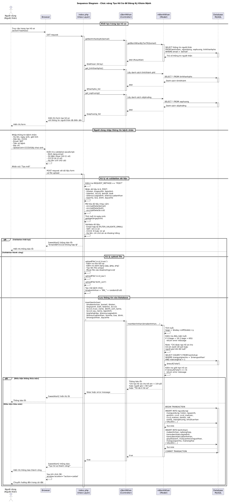

# Sequence UML Diagram - Chức năng Tạo Hồ Sơ Khám Bệnh

## Mô tả
Đây là sơ đồ tuần tự (Sequence Diagram) mô tả quy trình tạo hồ sơ bệnh nhân để đăng ký khám bệnh trong hệ thống quản lý bệnh viện Hạnh Phúc.

## Sơ đồ



*Sơ đồ tuần tự mô tả quy trình tạo hồ sơ đăng ký khám bệnh*

### Files có sẵn:
- **taohoso-sequence-diagram.puml**: PlantUML source code
- **taohoso-sequence-diagram.png**: Hình ảnh PNG (1608 x 3456 pixels)
- **taohoso-sequence-diagram.svg**: Vector SVG (có thể scale lên mà không mất chất lượng)

## Các thành phần tham gia

### 1. Người dùng (Actor)
- **Vai trò**: Người thân (người giám hộ) của bệnh nhân
- **Mục đích**: Tạo hồ sơ khám bệnh cho trẻ em dưới 18 tuổi hoặc người già trên 60 tuổi

### 2. Browser
- Giao diện người dùng
- Xử lý validation phía client
- Hiển thị thông báo và form

### 3. View Layer (Views/benhnhan/pages/taohoso/index.php)
- Hiển thị form tạo hồ sơ
- Xử lý request POST
- Validate dữ liệu đầu vào
- Mã hóa thông tin nhạy cảm
- Xử lý upload file

### 4. Controller Layer (Controllers/cbenhnhan.php)
- Class: `cBenhNhan`
- Xử lý logic nghiệp vụ
- Gọi các phương thức từ Model
- Trả về kết quả cho View

### 5. Model Layer (Models/mbenhnhan.php)
- Class: `mBenhNhan`
- Tương tác với Database
- Thực hiện các truy vấn SQL
- Kiểm tra các điều kiện nghiệp vụ

### 6. Database (MySQL)
- Lưu trữ thông tin bệnh nhân
- Các bảng chính:
  - `nguoidung`: Thông tin cơ bản người dùng
  - `benhnhan`: Thông tin bệnh nhân
  - `tinhthanhpho`: Danh sách tỉnh/thành phố
  - `xaphuong`: Danh sách xã/phường

## Quy trình chính

### Bước 1: Khởi tạo trang
1. Người dùng truy cập trang tạo hồ sơ (action=taohoso)
2. Hệ thống lấy thông tin người thân từ database
3. Hệ thống lấy danh sách tỉnh/thành phố và xã/phường
4. Form được hiển thị với thông tin người thân đã điền sẵn

### Bước 2: Nhập thông tin
Người dùng nhập các thông tin:
- **Thông tin cá nhân**: Họ tên, ngày sinh, giới tính, dân tộc
- **Giấy tờ**: CCCD/CMND (9-12 số)
- **Liên hệ**: Email, số điện thoại
- **Tiền sử bệnh**: Của bản thân và gia đình
- **Địa chỉ**: Số nhà, xã/phường, tỉnh/thành phố
- **Upload file**: Ảnh CCCD mặt trước/sau hoặc giấy khai sinh

### Bước 3: Validation
**Phía Client (JavaScript)**:
- Định dạng email
- Số điện thoại (10-11 số)
- CCCD (9 hoặc 12 số)
- Họ tên (chỉ chữ cái)

**Phía Server (PHP)**:
- Email hợp lệ (FILTER_VALIDATE_EMAIL)
- Số điện thoại: regex /^\d{10,11}$/
- CCCD: regex /^\d{9}$|^\d{12}$/
- Họ tên: regex /^[a-zA-ZÀ-ỹ\s]+$/u

### Bước 4: Xử lý upload file
- Kiểm tra file tồn tại và không có lỗi
- Validate định dạng (jpg, jpeg, png)
- Tạo tên file unique: `uniqid('upload_').'.'.$ext`
- Lưu vào thư mục: `Assets/img/cccd/`

### Bước 5: Tạo mã bệnh nhân
- Format: `BN_XXXXXXXX` (8 chữ số ngẫu nhiên)
- Ví dụ: `BN_12345678`

### Bước 6: Kiểm tra điều kiện nghiệp vụ
1. **Kiểm tra tuổi**:
   - Quy tắc nghiệp vụ: Chỉ được tạo hồ sơ cho trẻ em < 18 tuổi HOẶC người già > 60 tuổi
   - Code hiện tại: `if (!($age < 18 || $age > 60))` - logic này sẽ trả về lỗi nếu age < 18 hoặc age > 60
   - **Lưu ý**: Có thể có inconsistency trong logic validation. Diagram phản ánh code hiện tại.
   - Nếu không thỏa: Trả về lỗi "Chỉ được tạo hồ sơ cho trẻ em dưới 18 tuổi hoặc người già trên 60 tuổi."

2. **Kiểm tra số lượng hồ sơ**:
   - Một người giám hộ chỉ được tạo tối đa 4 hồ sơ
   - Query: `SELECT COUNT(*) FROM benhnhan WHERE manguoigiamho = ? AND matrangthai = 1`
   - Nếu >= 4: Trả về lỗi

### Bước 7: Lưu vào Database
Sử dụng **Transaction** để đảm bảo tính toàn vẹn dữ liệu:

1. **BEGIN TRANSACTION**

2. **INSERT vào bảng `nguoidung`**:
   ```sql
   INSERT INTO nguoidung (
     manguoidung, hoten, ngaysinh, gioitinh, 
     cccd, cccd_matruoc, cccd_matsau, 
     dantoc, sdt, sonha, maxaphuong, emailcanhan
   ) VALUES (...)
   ```

3. **INSERT vào bảng `benhnhan`**:
   ```sql
   INSERT INTO benhnhan (
     mabenhnhan, nghenghiep, 
     tiensubenhtatcuagiadinh, tiensubenhtatcuabenhnhan,
     giaykhaisinh, moiquanhevoinguoithan, 
     manguoigiamho, matrangthai
   ) VALUES (...)
   ```

4. **COMMIT TRANSACTION**

### Bước 8: Thông báo kết quả
- **Thành công**: 
  - Hiển thị SweetAlert2: "Tạo hồ sơ thành công!"
  - Chuyển hướng đến trang cài đặt (action=caidat)
  
- **Thất bại**: 
  - Hiển thị SweetAlert2 với thông báo lỗi cụ thể
  - Người dùng có thể sửa và thử lại

## Mã hóa dữ liệu
Các thông tin nhạy cảm được mã hóa trước khi lưu:
- Email: `encryptData($email)`
- Số điện thoại: `encryptData($sdt)`
- CCCD: `encryptData($cccd)`

Hàm mã hóa được định nghĩa trong `Assets/config.php`

## Các trường hợp đặc biệt

### 1. Người dùng < 16 tuổi
- Không yêu cầu email (có thể để trống)
- Có thể không cần upload CCCD
- Khuyến khích upload giấy khai sinh

### 2. Người dùng >= 16 tuổi
- Email bắt buộc và phải hợp lệ (validation: `$age >= 16 && !empty($rawEmail)`)
- Yêu cầu upload CCCD mặt trước và mặt sau

### 3. Quan hệ với người thân
Các lựa chọn:
- Bố
- Mẹ
- Con

## File liên quan

### View
- `Views/benhnhan/pages/taohoso/index.php`: Form tạo hồ sơ
- `Views/benhnhan/pages/taohoso/css.css`: Styling
- `Views/benhnhan/pages/taohoso/js.php`: JavaScript validation

### Controller
- `Controllers/cbenhnhan.php`: Controller xử lý logic bệnh nhân
- `Controllers/ctaikhoan.php`: Controller xử lý tài khoản
- `Controllers/ctinhthanhpho.php`: Controller lấy danh sách tỉnh/thành phố
- `Controllers/cxaphuong.php`: Controller lấy danh sách xã/phường

### Model
- `Models/mbenhnhan.php`: Model tương tác database cho bệnh nhân
- `Models/ketnoi.php`: Class kết nối database

### Config
- `Assets/config.php`: Cấu hình và các hàm tiện ích (encryptData, decryptData)

## Cách xem diagram

### Online
Sử dụng PlantUML Online Server:
1. Truy cập: http://www.plantuml.com/plantuml/uml/
2. Copy nội dung file `.puml` và paste vào
3. Diagram sẽ được tự động render

### Local
1. Cài đặt PlantUML:
   ```bash
   # Cài đặt qua brew (macOS)
   brew install plantuml
   
   # Hoặc download từ https://plantuml.com/download
   ```

2. Tạo diagram PNG:
   ```bash
   plantuml taohoso-sequence-diagram.puml
   ```

3. Hoặc sử dụng VS Code extension:
   - Cài extension "PlantUML"
   - Mở file `.puml`
   - Alt+D để preview

## Ghi chú bảo mật

1. **Mã hóa dữ liệu**: Email, SĐT, CCCD được mã hóa trước khi lưu
2. **Validation**: Kiểm tra dữ liệu cả phía client và server
3. **File upload**: Chỉ chấp nhận các định dạng ảnh (jpg, jpeg, png)
4. **SQL Injection**: Sử dụng prepared statements trong các query
5. **Transaction**: Đảm bảo tính toàn vẹn dữ liệu khi INSERT

## Cải tiến trong tương lai

1. Thêm validation cho file upload (kích thước, nội dung)
2. Sử dụng ORM thay vì raw SQL
3. Thêm logging cho các thao tác quan trọng
4. Implement rate limiting để chống spam
5. Thêm CAPTCHA cho form submission
6. Sử dụng hashing thay vì encryption cho CCCD

## Tác giả
- Khóa luận tốt nghiệp - Bệnh viện Hạnh Phúc
- Cập nhật: 2025-12-03
