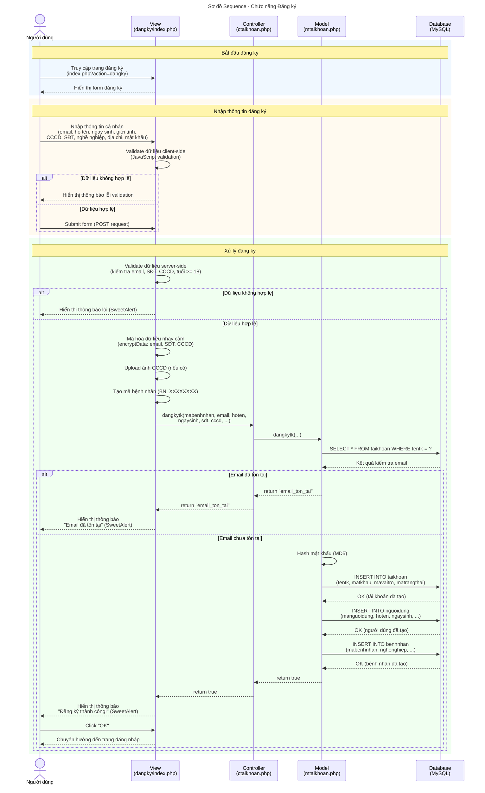
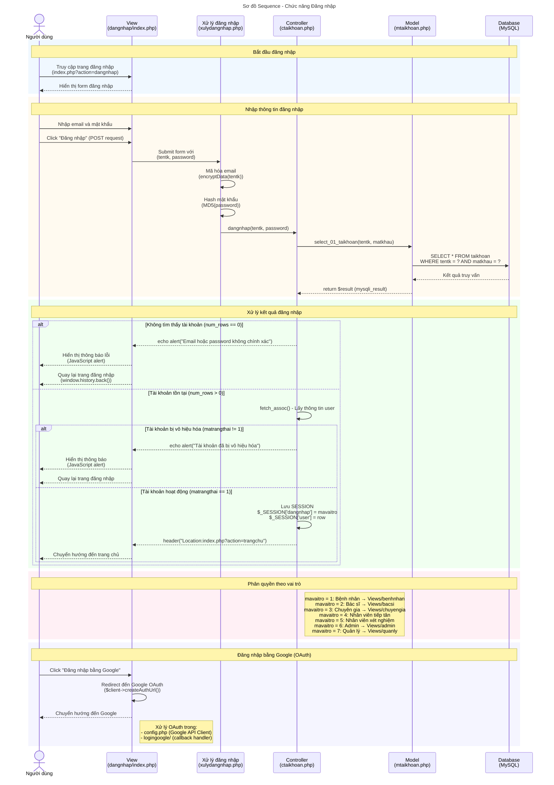
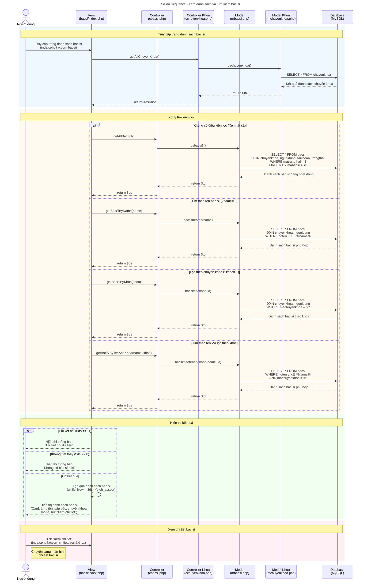

# Sơ đồ Sequence - Mermaid Code

Dưới đây là code Mermaid cho các sơ đồ sequence. Bạn có thể copy và paste vào bất kỳ công cụ nào hỗ trợ Mermaid như:
- GitHub (trong file `.md`)
- GitLab
- Notion
- Mermaid Live Editor: https://mermaid.live/

---

## 1. Sơ đồ Sequence - Đăng ký tài khoản



---

## 2. Sơ đồ Sequence - Đăng nhập



---

## 3. Sơ đồ Sequence - Xem danh sách và Tìm kiếm bác sĩ



---

## Hướng dẫn sử dụng

### Trên GitHub
Tạo file `.md` và paste code Mermaid vào trong block:
````markdown
```mermaid
// code ở đây
```
````

### Trên Mermaid Live Editor
1. Truy cập https://mermaid.live/
2. Paste code Mermaid vào panel bên trái
3. Xem kết quả realtime bên phải
4. Export thành PNG/SVG nếu cần

### Trên Notion
1. Gõ `/code` để tạo code block
2. Chọn ngôn ngữ "Mermaid"
3. Paste code vào

### Trên VS Code
1. Cài extension "Markdown Preview Mermaid Support"
2. Mở file `.md` có chứa code Mermaid
3. Nhấn `Ctrl+Shift+V` để preview
