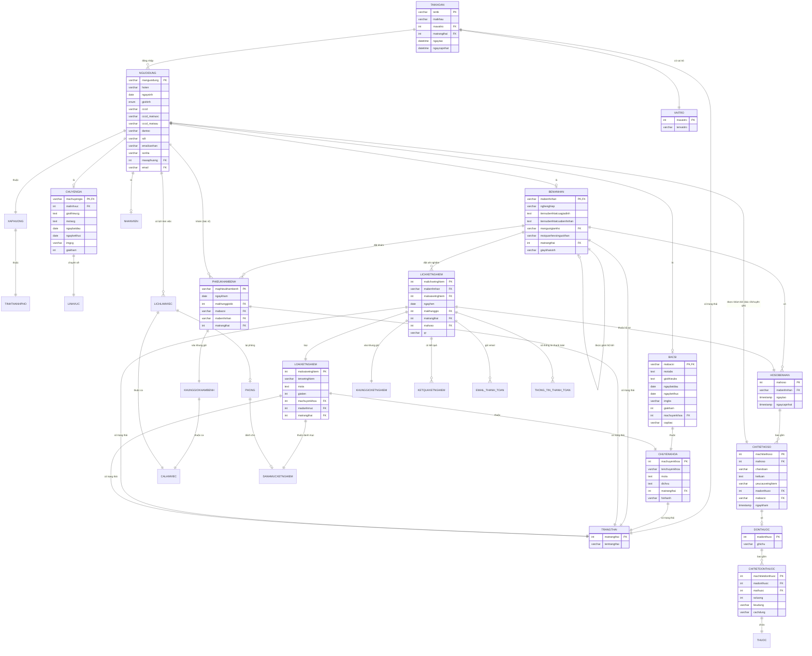

# Sơ Đồ Domain - Hệ Thống Quản Lý Bệnh Viện Hạnh Phúc

## Mô tả
Sơ đồ này mô tả các thực thể chính và mối quan hệ giữa chúng trong hệ thống quản lý bệnh viện Hạnh Phúc.

## Sơ Đồ Domain



## Giải Thích Các Thực Thể Chính

### 1. Quản Lý Người Dùng
- **TAIKHOAN**: Tài khoản đăng nhập của người dùng
- **NGUOIDUNG**: Thông tin chung của tất cả người dùng trong hệ thống
- **VAITRO**: Phân quyền (Bệnh nhân, Bác sĩ, Nhân viên, Quản trị viên)
- **TRANGTHAI**: Trạng thái hoạt động/khóa của tài khoản

### 2. Người Dùng Chuyên Biệt
- **BACSI**: Bác sĩ với thông tin chuyên khoa, giá khám, kinh nghiệm
- **BENHNHAN**: Bệnh nhân với tiền sử bệnh, người giám hộ (cho trẻ em/người cao tuổi)
- **CHUYENGIA**: Chuyên gia tư vấn trong các lĩnh vực đặc biệt
- **NHANVIEN**: Nhân viên hành chính

### 3. Hồ Sơ Bệnh Án
- **HOSOBENHAN**: Hồ sơ bệnh án tổng hợp của bệnh nhân
- **CHITIETHOSO**: Chi tiết từng lần khám (chẩn đoán, kết luận, bác sĩ khám)
- **DONTHUOC**: Đơn thuốc kê cho bệnh nhân
- **CHITIETDONTHUOC**: Chi tiết các loại thuốc trong đơn

### 4. Đặt Lịch Khám
- **PHIEUKHAMBENH**: Phiếu đặt lịch khám bệnh
- **KHUNGGIOKHAMBENH**: Khung giờ khám (7h-8h, 8h-9h, v.v.)
- **CALAMVIEC**: Ca làm việc (sáng, chiều, tối)
- **LICHLAMVIEC**: Lịch làm việc của bác sĩ/chuyên gia

### 5. Xét Nghiệm
- **LICHXETNGHIEM**: Lịch hẹn xét nghiệm của bệnh nhân
- **LOAIXETNGHIEM**: Các loại xét nghiệm (xét nghiệm máu, tim mạch, v.v.)
- **DANHMUCXETNGHIEM**: Danh mục phân loại xét nghiệm
- **KETQUAXETNGHIEM**: Kết quả xét nghiệm
- **KHUNGGIOXETNGHIEM**: Khung giờ xét nghiệm

### 6. Địa Chỉ
- **TINHTHANHPHO**: Tỉnh/Thành phố
- **XAPHUONG**: Xã/Phường/Quận

### 7. Khác
- **CHUYENKHOA**: Các chuyên khoa (Nhi, Tim mạch, Thần kinh, v.v.)
- **LINHVUC**: Lĩnh vực chuyên môn của chuyên gia
- **PHONG**: Phòng khám/phòng xét nghiệm
- **THUOC**: Thông tin thuốc

## Luồng Hoạt Động Chính

### 1. Đăng Ký Và Đăng Nhập
```
TAIKHOAN → NGUOIDUNG → [BACSI | BENHNHAN | NHANVIEN | CHUYENGIA]
```

### 2. Đặt Lịch Khám
```
BENHNHAN → PHIEUKHAMBENH → KHUNGGIOKHAMBENH → BACSI/CHUYENGIA
```

### 3. Khám Bệnh
```
BENHNHAN → HOSOBENHAN → CHITIETHOSO → DONTHUOC → THUOC
```

### 4. Xét Nghiệm
```
BENHNHAN → LICHXETNGHIEM → LOAIXETNGHIEM → KETQUAXETNGHIEM
```

### 5. Thanh Toán
```
LICHXETNGHIEM → EMAIL_THANH_TOAN/THONG_TIN_THANH_TOAN
```

## Các Mối Quan Hệ Đặc Biệt

1. **Người Giám Hộ**: Bệnh nhân có thể là người giám hộ cho bệnh nhân khác (trẻ em hoặc người cao tuổi)
2. **Bác Sĩ/Chuyên Gia**: Cả hai đều có thể khám bệnh nhân, được phân biệt bởi vai trò trong CHITIETHOSO
3. **Lịch Làm Việc**: Bác sĩ và chuyên gia có lịch làm việc riêng, liên kết với khung giờ khám
4. **Trạng Thái**: Nhiều thực thể sử dụng chung bảng TRANGTHAI để quản lý trạng thái

## Quy Tắc Nghiệp Vụ

1. Một người giám hộ chỉ được tạo tối đa 4 hồ sơ bệnh nhân
2. Chỉ được tạo hồ sơ cho trẻ em dưới 18 tuổi hoặc người già trên 60 tuổi khi có người giám hộ
3. Bác sĩ/Chuyên gia phải có lịch làm việc trước khi bệnh nhân có thể đặt lịch khám
4. Mỗi phiếu khám bệnh phải có khung giờ cụ thể và không trùng lặp
5. Hồ sơ bệnh án được tạo tự động khi bệnh nhân đăng ký lần đầu
6. Đơn thuốc chỉ được kê sau khi có chẩn đoán trong chi tiết hồ sơ
