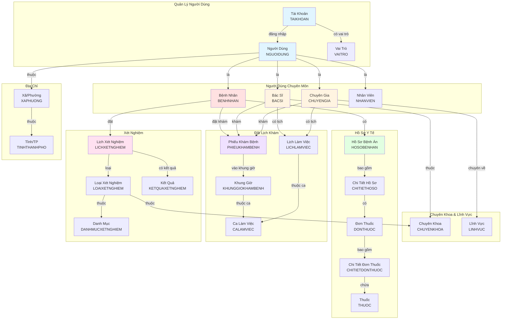
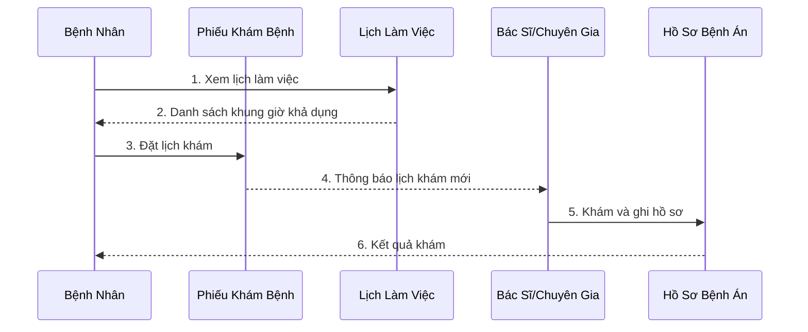
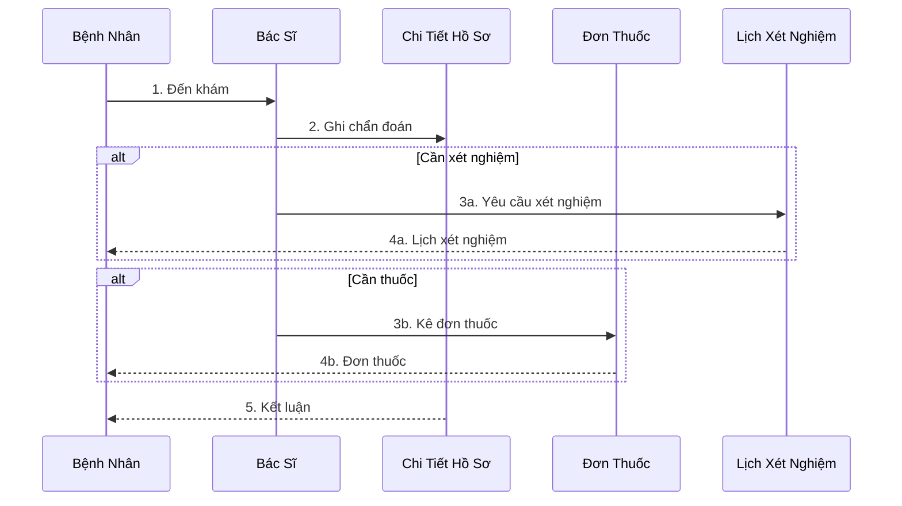
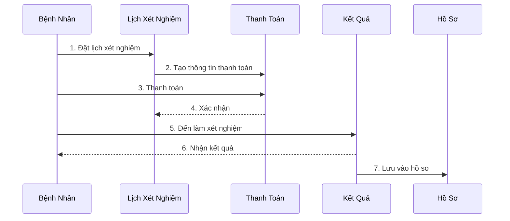
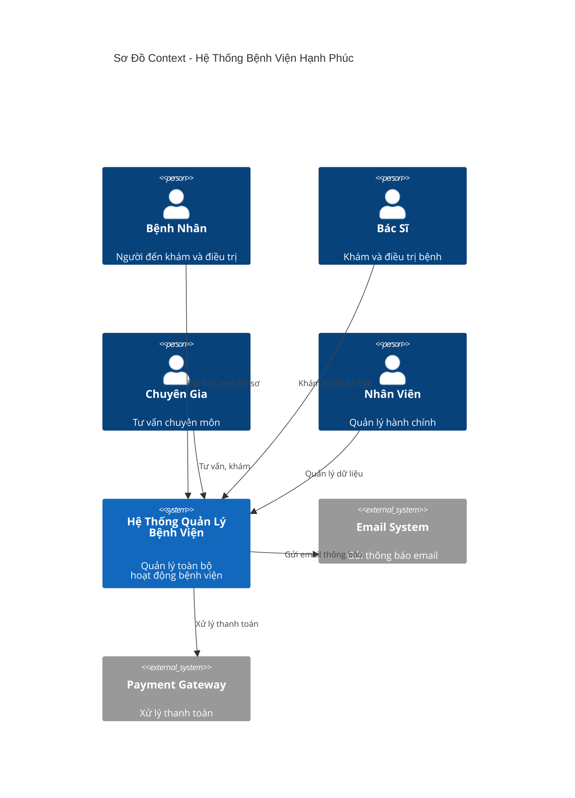

# Sơ Đồ Domain Tổng Quan - Bệnh Viện Hạnh Phúc

## Sơ Đồ Tổng Quan (High-Level Domain View)

## Sơ Đồ Luồng Hoạt Động

### Luồng 1: Bệnh Nhân Đặt Lịch Khám

### Luồng 2: Khám Bệnh và Kê Đơn Thuốc

### Luồng 3: Xét Nghiệm

## Sơ Đồ Domain Context

## Các Thành Phần Chính

### 1. **Quản Lý Người Dùng** (User Management)
   - Xác thực và phân quyền
   - Quản lý thông tin cá nhân
   - Quản lý địa chỉ

### 2. **Quản Lý Hồ Sơ Y Tế** (Medical Records)
   - Hồ sơ bệnh án điện tử
   - Lịch sử khám bệnh
   - Đơn thuốc và thuốc

### 3. **Quản Lý Lịch Hẹn** (Appointment Management)
   - Đặt lịch khám bệnh
   - Lịch làm việc bác sĩ
   - Khung giờ và ca làm việc

### 4. **Quản Lý Xét Nghiệm** (Lab Management)
   - Đặt lịch xét nghiệm
   - Các loại xét nghiệm
   - Kết quả xét nghiệm

### 5. **Quản Lý Chuyên Khoa** (Department Management)
   - Các chuyên khoa
   - Bác sĩ theo chuyên khoa
   - Dịch vụ của từng khoa

## Các Ràng Buộc Domain

1. **Giám Hộ**: Một người giám hộ có thể quản lý tối đa 4 hồ sơ bệnh nhân (trẻ em < 18 tuổi hoặc người già > 60 tuổi)

2. **Lịch Làm Việc**: Bác sĩ/Chuyên gia chỉ có thể được đặt lịch khám trong khung giờ họ làm việc

3. **Trạng Thái**: Tất cả các thực thể quan trọng đều có trạng thái (đang hoạt động, đã khóa, đã hủy, v.v.)

4. **Phân Quyền**: Mỗi tài khoản có một vai trò xác định quyền truy cập

5. **Hồ Sơ Bệnh Án**: Mỗi bệnh nhân có một hoặc nhiều hồ sơ, mỗi hồ sơ có nhiều chi tiết khám

6. **Đơn Thuốc**: Đơn thuốc chỉ được tạo sau khi có chẩn đoán trong chi tiết hồ sơ

## Thuật Ngữ Domain (Ubiquitous Language)

| Tiếng Việt | Tiếng Anh | Định Nghĩa |
|------------|-----------|------------|
| Bệnh nhân | Patient | Người đến khám và điều trị tại bệnh viện |
| Bác sĩ | Doctor | Người có chuyên môn y khoa, khám và điều trị bệnh |
| Chuyên gia | Expert/Specialist | Người có chuyên môn sâu trong lĩnh vực cụ thể |
| Hồ sơ bệnh án | Medical Record | Tập hợp thông tin y tế của bệnh nhân |
| Phiếu khám bệnh | Medical Examination Form | Đơn đặt lịch khám với bác sĩ |
| Đơn thuốc | Prescription | Danh sách thuốc được kê bởi bác sĩ |
| Xét nghiệm | Lab Test | Các kiểm tra y tế để chẩn đoán |
| Chuyên khoa | Department | Phân loại theo lĩnh vực y tế (Nhi, Tim mạch, v.v.) |
| Người giám hộ | Guardian | Người chịu trách nhiệm cho bệnh nhân nhỏ tuổi/cao tuổi |
| Khung giờ khám | Time Slot | Khoảng thời gian cụ thể để khám bệnh |

